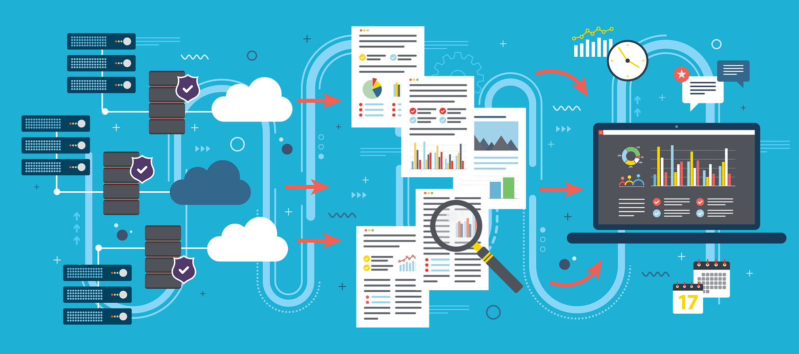

  

## Projetos:

## Edirlan Soares
Desenvolvedor Business Intelligence (BI) aplicando as melhores práticas de análise e desenvolvimento, nas ferramentas Power BI(DAX e M), Pentaho (PDI), Integration Services (SSIS), Analysis Services (SSAS) e SQL Server. 

* Graduação em Gestão em Tecnologia da Informação.
* Pós Graduação em Bussines Intelligence e Analytics.
* Especialiação BI Academy - Rafael Piton.
* Curso Data Science na Pratica - Sigmoidal 
* Escola de Data Science - Sigmoidal

**Links:**

<a class="badge-base__link LI-simple-link" href="https://br.linkedin.com/in/edirlansoares?trk=profile-badge">Edirlan Carlos Soares</a>

              

