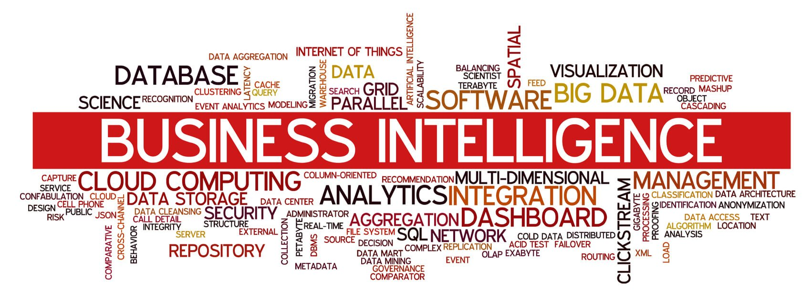

  

## Edirlan Soares
Especialista em Business Intelligence & Analytics, hard skills em Microsoft BI tools (SSAS, SSIS, SSRS, SQL Server e Power BI)

<a class="badge-base__link LI-simple-link" href="https://br.linkedin.com/in/edirlansoares?trk=profile-badge"> Linkedin</a>

## Formação:
- Graduação em Gestão da Tecnologia da Informação pela Faculdades OPET.
- Pós-graduação em Business Intelligence & Analytics pela Puc Minas.

<a class="badge-base__link LI-simple-link" href="https://www.credly.com/badges/53407672-0fa1-440e-a6fe-f77eb939b22c?source=linked_in_profile">Microsoft Certified: Data Analyst Associate</a>
 

## Projetos:

<a class="badge-base__link LI-simple-link" href="https://app.powerbi.com/view?r=eyJrIjoiNDc0N2Y3YzQtNGQyNy00MjNjLWJlNzUtMzhhZTc5ZjAxNzUxIiwidCI6ImJjODAwMGFiLTg2MmUtNGFiYS05MWQ5LTFhNzE5MTdmYzJmYSJ9"> Logística</a>

              

